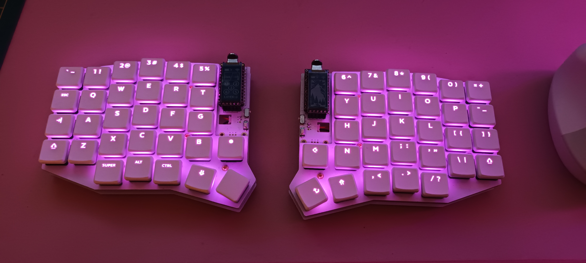

# My Sofle Choc Wireless ZMK Configuration

This repository contains my personal ZMK firmware configuration for my Sofle Choc Wireless keyboard.

The configuration built using GitHub Actions.

## Keyboard Hardware

The keyboard is based on the Sofle revision by [dc-ok](https://github.com/db-ok/), [SofleChocWireless](https://github.com/db-ok/SofleChocWireless). The hardware file are also part of this repo in a submodule.

## Firmware Configuration

- **Keymap:** The keymap is defined in `config/sofle.keymap`.
- **Configuration:** Additional ZMK settings are in `config/sofle.conf`.

## Building the Firmware

This repository uses GitHub Actions to build the firmware automatically whenever changes are pushed. The build workflow is defined in `.github/workflows/build.yml` and the build matrix in `build.yaml`.

The compiled firmware can be downloaded from the **Actions** tab of this repository.
